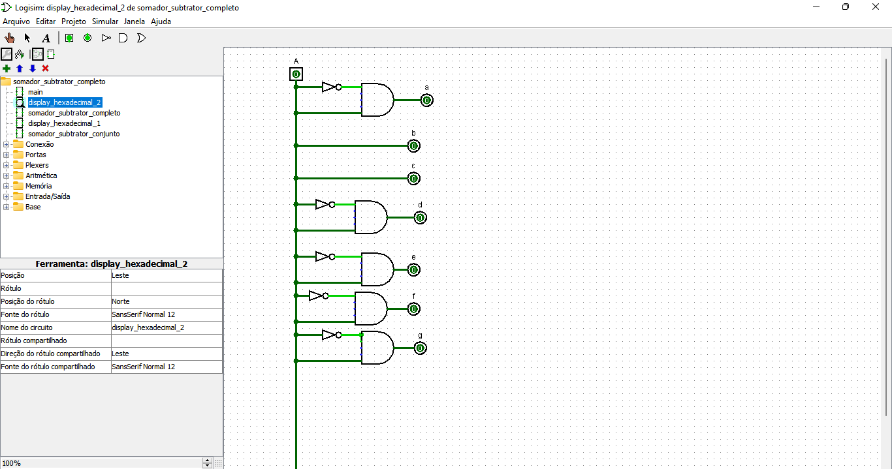

# SomaSub

Projeto antigo feito para a disciplina "Circuitos digitais". Esse projeto é um somador subtrator completo que soma e subtrai dois números de 4 bits e apresenta o resultado como um número hexadecimal em um display de 7 segmentos. Foi feito em conjunto com Enzo Eduardo Cassiano Ibiapina e implementado no software Logisim. 

O projeto é composto por 5 circuitos: *display_hexadecimal* 1 e 2 determinam o funcionamento do display para unidade e dezena. *somador_subtrator_completo* determina a soma/subtração de 2 números de 1 bit. *somador_subtrator_conjunto* agrupa e organiza vários somadores/subtratores pra realizar a operação com números de 4 bits. *main* é basicamente uma "interface" que liga os binários tanto dos operandos quanto do resultado aos displays.

Os circuitos foram planejados através de tabelas verdades que descreviam as saídas esperadas com base nas entradas fornecidas.

## Instruções

No circuito *main* dentro do Logisim, clique nas caixinhas para ativar ou desativar um bit. As caixas A1, B1, C1 e D1 representam os bits(nessa ordem) do primeiro número. De maneira análoga, A2, B2, C2 e D2 representam os do segundo. A caixa M define a operação(0 -> Soma e 1 -> Subtração)

## Tabelas verdades

### Somador subtrator completo

### Display de 7 segmentos(unidade)

### Display de 7 segmentos(dezena)

## Circuitos

### Display hexadecimal para unidades

### Display hexadecimal para dezenas

### Somador/subtrator completo

### Somador/subtrator conjunto

### Circuito principal(main)

## Exemplos de execução

### 6 + 4 = A 

### F + 8 = 17

### 3 - 2 = 1

